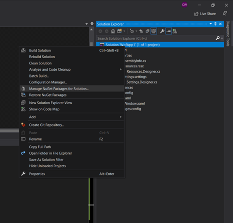
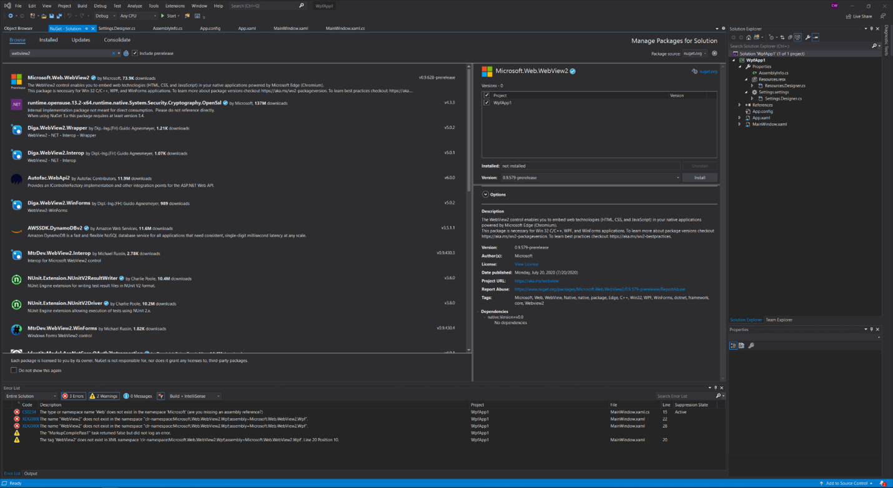
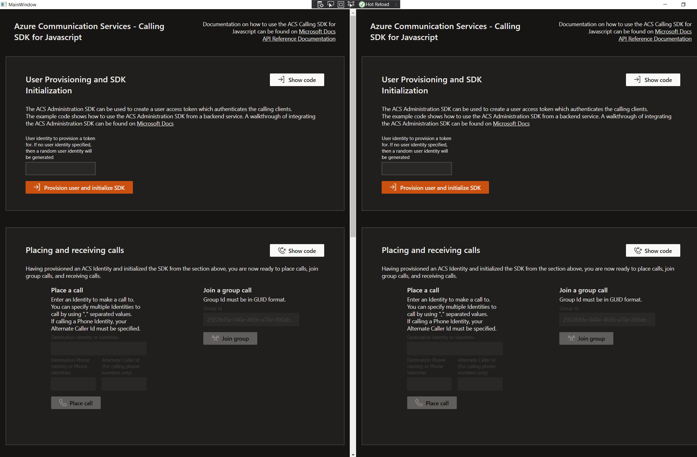
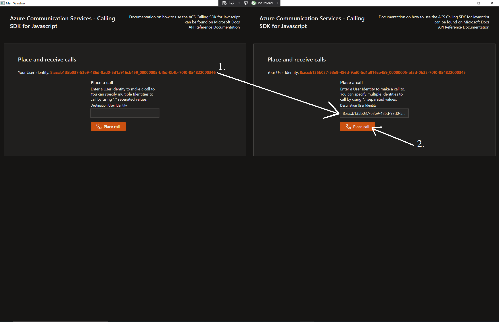

# Project Name

ACS Calling Sample for WPF.

## Features

This project framework provides the following features:

* Uses the ACS Calling Web SDK inside of a desktop application.
* This wpf sample uses WebView2 SDK.

## Getting Started

### Prerequisites

- [npm](https://www.npmjs.com/get-npm)
- [Node.js](https://nodejs.org/en/download/)
- Microsoft Edge (Chromium)
- [Visual Studio 2017 or later](https://visualstudio.microsoft.com/)
- [VS workload required: Microsoft.VisualStudio.Workload.ManagedDesktop](https://docs.microsoft.com/en-us/visualstudio/install/workload-component-id-vs-enterprise?view=vs-2019&preserve-view=true#net-desktop-development)
- .NET Framework. It can be installed from Visual Studio Installer.

### Installation 
1. git clone https://github.com/Azure-Samples/communication-services-web-calling-wpf-sample
2. Get a connection string by provisioning an Azure Communication Services resource from the Azure portal. Use the connection string as value for key `connectionString` in /project/webapp/config.json
3. `cd project/webapp`
4. `npm install`
5. `npm run build`
6. `npm run start` and wait for server to start up, it will run in localhost:5000
7. In the ```/project``` directory from the cloned reposity, open WpfApp.sln in Visual Studio
8. From Visual Studio solution explorer, right click on the project solution (WpfApp.sln) and click on "Manage Nuget packages..."

9. From NuGet dialog, browse for Microsoft.Web.WebView2 (Make sure to check the "Include prerelease" box) and install version 1.0.864.35

10. Build and run the WPF app from Visual Studio and the WPF app should come up. This WPF app has two web views. In each web view you should see an ACS Calling web application

11. From either of the ACS Calling web applications:
    1. Copy and paste the User Identity into the other webapp's "Destination User Identity" input box
    2. Click on the "Place call" button for the caller to start the call.

12. The call will start ringing. Click on the "Accept" button from the callee side.

13. The call will connect and both ACS Calling web application will be able to speak to each other


## Troubleshooting
1. If the WpfApp shows up blank, reinstall the Microsoft.Web.WebView2 SDK version 0.9.579-prerelease from the Nuget Package Manager dialogue (Right click on WpfApp solutions, then click "Manage NuGet Packages for Solution..."). 
2. Please post any issues, and the ACS Calling team will reply and look into any issues as soon as possible: https://github.com/Azure-Samples/communication-services-web-calling-wpf-sample/issues

## Resources
- Documentation on how to use the ACS Calling SDK for Javascript can be found on https://docs.microsoft.com/en-gb/azure/communication-services/quickstarts/voice-video-calling/calling-client-samples?pivots=platform-web
- ACS Calling SDK for Javascript API reference documentation can be found on https://docs.microsoft.com/en-us/javascript/api/azure-communication-services/@azure/communication-calling/?view=azure-communication-services-js
- Guide for building a WPF app from scratch with WebView2 SDK: https://docs.microsoft.com/en-us/microsoft-edge/webview2/gettingstarted/wpf
