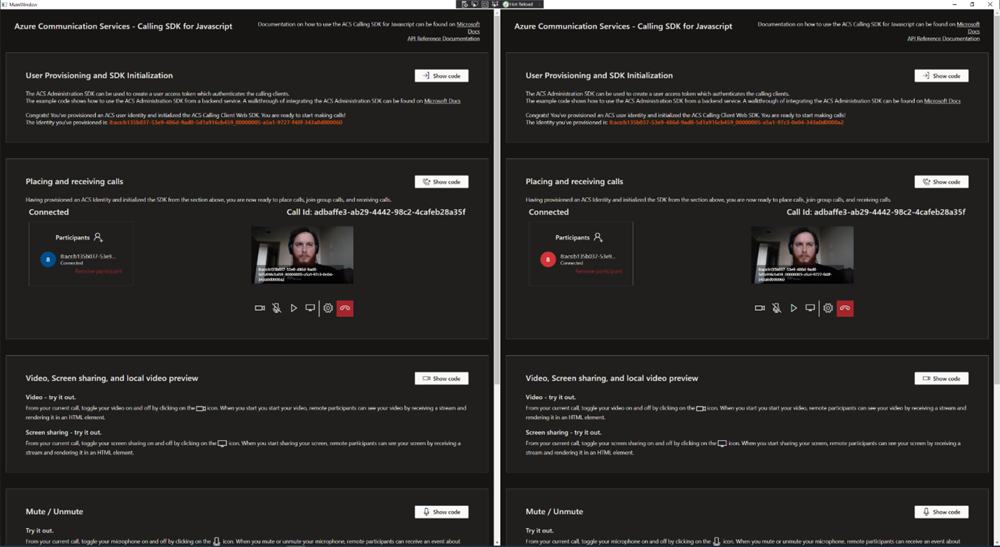

# Project Name

ACS Calling Sample for WPF.

## Features

This project framework provides the following features:

* Embeds the ACS Calling Tutorial web application inside of a desktop application.

## Getting Started

### Prerequisites

- [npm](https://www.npmjs.com/get-npm)
- [Node.js](https://nodejs.org/en/download/)
- [Microsoft Edge (Chromium) Canary Chanel](https://www.microsoftedgeinsider.com/en-us/download)
- [Visual Studio 2017 or later](https://visualstudio.microsoft.com/)
- .NET Framework. It can be installed from Visual Studio Installer.

### Installation

1. You will first need to set up and run the ACS Calling Tutorial project on localhost:5000. To do this, please follow the README file on the repo https://github.com/Azure-Samples/communication-services-web-calling-tutorial 
2. git clone https://github.com/Azure-Samples/communication-services-web-calling-wpf-sample
3. cd project
4. Open WpfApp.sln in Visual Studio
5. From Visual Studio solution explorer, right click on the project solution (WpfApp.sln) and click on "Manage Nuget packages..."

6. From NuGet dialog, browse for Microsoft.Web.WebView2 (Make sure to check the "Include prerelease" box) and install version 0.9.579-prerelease

7. Start the WPF app from Visual Studio and the WPF app should come up. This WPF app has two web views. In each web view you should see the ACS Calling Tutorial application

8. From the ACS Calling Tutorial applications, click on the orange "Provision user and initialize SDK" buttons. You will now be able to do calls. Click on the orange "Join group" buttons for both ACS Calling applications to joing a group call:

## Troubleshooting
1. If the WpfApp shows up blank, reinstall the Microsoft.Web.WebView2 SDK version 0.9.579-prerelease from the Nuget dialogue.
2. Please post any issues, and the ACS Calling team will reply and look into any issues as soon as possible
## Resources

(Any additional resources or related projects)

- Link to supporting information
- Link to similar sample
- ...
