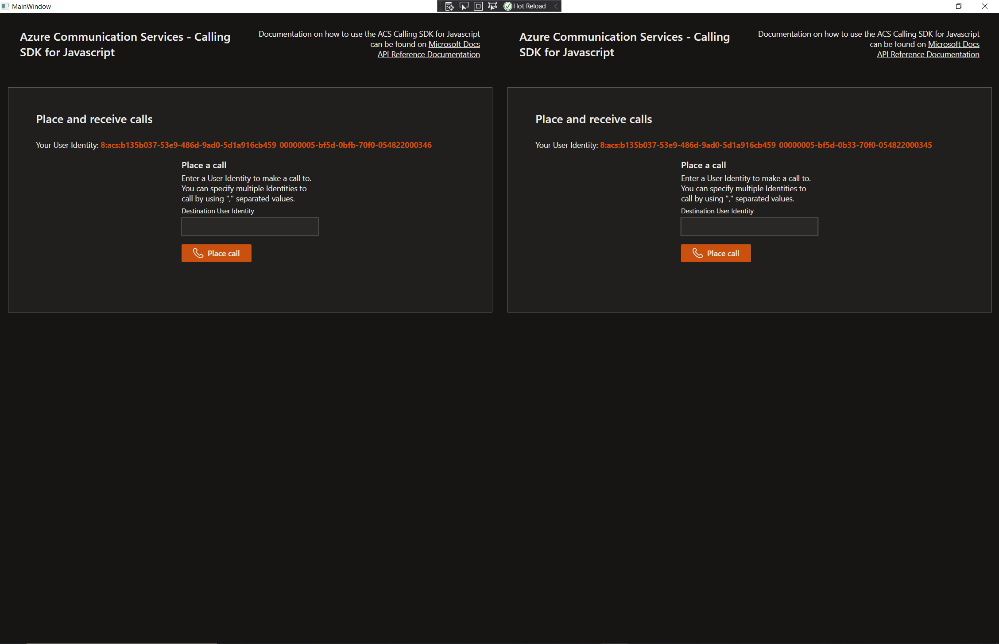

# Project Name

ACS Calling Sample for WPF.

## Features

This project framework provides the following features:

* Embeds the ACS Calling Tutorial web application inside of a desktop application. The ACS Calling Tutorial used the ACS Calling SDK.
* This wpf sample uses WebView2 SDK.

## Getting Started

### Prerequisites

- [npm](https://www.npmjs.com/get-npm)
- [Node.js](https://nodejs.org/en/download/)
- [Microsoft Edge (Chromium) Canary Chanel](https://www.microsoftedgeinsider.com/en-us/download)
- [Visual Studio 2017 or later](https://visualstudio.microsoft.com/)
- [VS workload required: Microsoft.VisualStudio.Workload.ManagedDesktop](https://docs.microsoft.com/en-us/visualstudio/install/workload-component-id-vs-enterprise?view=vs-2019&preserve-view=true#net-desktop-development)
- .NET Framework. It can be installed from Visual Studio Installer.
- Microsoft.VisualStudio.Workload.ManagedDesktop

### Installation

1. Set up and run the ACS Calling Tutorial project on localhost:5000. To do this, please follow the README file on the repo https://github.com/Azure-Samples/communication-services-web-calling-tutorial 
2. git clone https://github.com/Azure-Samples/communication-services-web-calling-wpf-sample
3. cd project
4. In the ```project``` directory from the cloned reposity, open WpfApp.sln in Visual Studio
5. From Visual Studio solution explorer, right click on the project solution (WpfApp.sln) and click on "Manage Nuget packages..."

6. From NuGet dialog, browse for Microsoft.Web.WebView2 (Make sure to check the "Include prerelease" box) and install version 0.9.579-prerelease

7. Build and run the WPF app from Visual Studio and the WPF app should come up. This WPF app has two web views. In each web view you should see the ACS Calling Tutorial application

8. From both of the ACS Calling Tutorial applications, click on the "Provision user and initialize SDK" buttons. You will now be able to do calls. Click on the "Join group" button for both ACS Calling applications to join the group call:


## Troubleshooting
1. If the WpfApp shows up blank, reinstall the Microsoft.Web.WebView2 SDK version 0.9.579-prerelease from the Nuget Package Manager dialogue (Right click on WpfApp solutions, then click "Manage NuGet Packages for Solution..."). 
2. Please post any issues, and the ACS Calling team will reply and look into any issues as soon as possible: https://github.com/Azure-Samples/communication-services-web-calling-wpf-sample/issues

## Resources

(Any additional resources or related projects)

- Link to supporting information
- Link to similar sample
- ...
